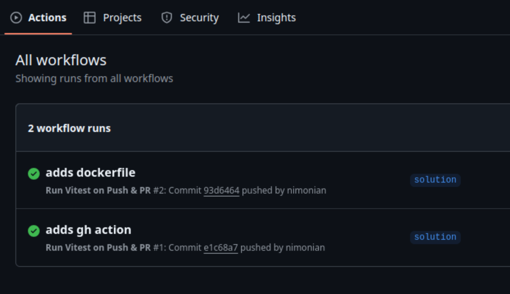

# Markit

[](https://github.com/corndel-swe/markit-Charlie-robin/actions/workflows/test.yaml)

Welcome to Markit!

This app is the frontend of a note-taking application, allowing users to write
in markdown and view a live preview of their work.

The purpose of this app is to allow you to set up some containerisation and
continuous integration and deployment (CI/CD) as practise.

## Containerising: Part 1

In the empty Dockerfile, you'll need to write some instructions for Docker to:

1. Extend the `node:18-alpine` base image

2. Set the working directory to `/app`

3. Copy the `package.json` and `package-lock.json` into the container

4. Run `npm install`

5. Copy the rest of the application code into the container

6. Expose port `5173`

7. Start the app with `npm run dev`

Once that is done, you should build the image and tag it with `markit:latest`,
then run your image in a container.

Congratulations! You containerised the app :)

## Running the app

You don't have to run the app in order to containerise it, but if you'd like to
see what it does, you can do

```
npm install
npm run dev
```

and visit localhost:5173.

If you don't have `node` and `npm` installed on your computer, no worries -
we're going to containerise the app so it will run anywhere, regardless of what
you do and don't have installed.

> [!TIP]
> 
> This whole workshop, including the Docker parts, can be done in a Codespace.

## Containerisation: Part 2

Now you can run apps inside containers, you should try to do the same to one of
your own apps.

Find a repo for a project you've worked on - it could be the Nozama API,
perhaps, or anything you want really - and try to create an image for the
project so you can run it in containers.

You will need to do a bit of research to understand how to package apps written
in the framework you have used. Getting your Dockerfile right can take a bit of
patience and searching - that's normal, don't get disheartened. Once you have a
working Dockerfile, you can use it as the basis for other project in the same
framework.

Once you have a working image, why not publish it on [Docker Hub](https://hub.docker.com/)
and get someone to pull and run it? And you can try pulling and running
somebody else's app.

## Github Actions

You will notice that there is a `.github/workflows` directory in this project.
It contains `test.yaml`. Take a look.

The `workflows` folder can contain
[Github Actions](https://github.com/features/actions), which are instructions
for Github to run various routines for us on different triggers, for example
pushing to a branch or making a pull request.

The `test.yaml` action runs the tests for this project whenever we push to
`main`.

If you head to the **Actions** tab of this repo on github.com, you should see
the results of these tests running:



Here are some things to try:

1. Try modifying this README and pushing the change to `main`, then watch the
   tests re-run.

2. Pushing to `main` is a bad idea. On Github, go to **Settings > Branches** and
   create a
   [branch protection rule](https://docs.github.com/en/repositories/configuring-branches-and-merges-in-your-repository/managing-protected-branches/about-protected-branches)
   that prevents pushing to main.

3. Now modify the `test.yaml` action so that it runs
   [on pull request](https://docs.github.com/en/actions/writing-workflows/choosing-when-your-workflow-runs/triggering-a-workflow#example-including-branches)
   into `main` rather than push.

4. Try creating a new branch, push it to Github and merge into `main` to check
   that it works.

5. Try
   [adding a badge](https://docs.github.com/en/actions/monitoring-and-troubleshooting-workflows/monitoring-workflows/adding-a-workflow-status-badge)
   to your README to show the world your tests are passing

## Actions marketplace

Once you have gotten `test.yaml` working, take some time to check out Github's
[Actions marketplace](https://github.com/marketplace?type=actions).

Try adding some actions to this repo (or any other practise repo you own).

Experiment with free actions to see what you can find. Is there anything useful
you could use in your projects?

A couple of interesting ones to try:

- [Super-linter](https://github.com/marketplace/actions/super-linter) will check
  your code for style

- [Dependency review](https://github.com/marketplace/actions/dependency-review)
  will run security checks on packages you install in your project

- [Snyk](https://github.com/marketplace/actions/snyk) can monitor your codebase
  for security issues and even automatically make a pull request with a fix if
  one is available
